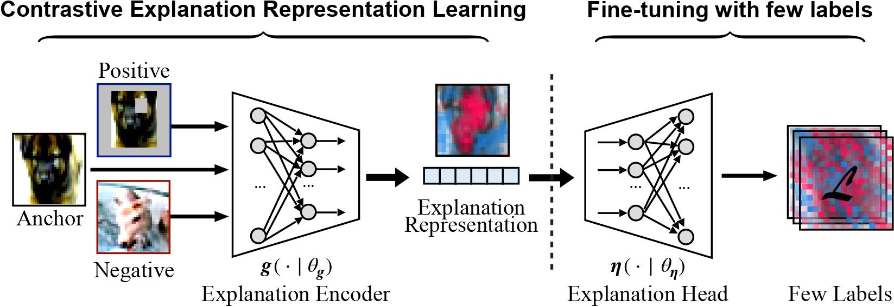

# CoRTX: Contrastive Framework for Real-time Explanation

## 1. About this work
### Abstract
- Recent advancements in explainable machine learning provide effective and faithful solutions for interpreting model behaviors. However, many explanation methods encounter efficiency issues, which largely limit their deployments in practical scenarios. Real-time explainer (RTX) frameworks have thus been proposed to accelerate the model explanation process by learning an one-feed-forward explainer. Existing RTX frameworks typically build the explainer under the supervised learning paradigm, which requires large amounts of explanation labels as the ground truth. Considering that accurate explanation labels are usually hard to obtain, due to constrained computational resources and limited human efforts, effective explainer training is still challenging in practice. In this work, we propose a COntrastive Real-Time eXplanation (CoRTX) framework to learn the explanation-oriented representation and relieve the intensive dependence of explainer training on explanation labels. Specifically, we design a synthetic strategy to select positive and negative instances for explanation representation learning. Theoretical analysis show that our selection strategy can benefit the contrastive learning process on explanation tasks. Experimental results on three real-world datasets further demonstrate the efficiency and efficacy of our proposed CoRTX framework.

### CoRTX Framework
- The pipeline first obtains the explanation encoder for contrastive explanation representation learning, and then the explanation head is tuned with a small amount of explanation labels.
<div align=center>

</div>


## 2 Developed Environment and Dependency
- Please follow the settings in requirement.txt


## 3. Experiment Reproducibility
- To train our code from scratch, please follow the instruction below:
```
$ bash run_adult.sh
```

- To train our code from pre-trained weight, please follow the instruction below:
```
$ bash pretrian_adult.sh
```

